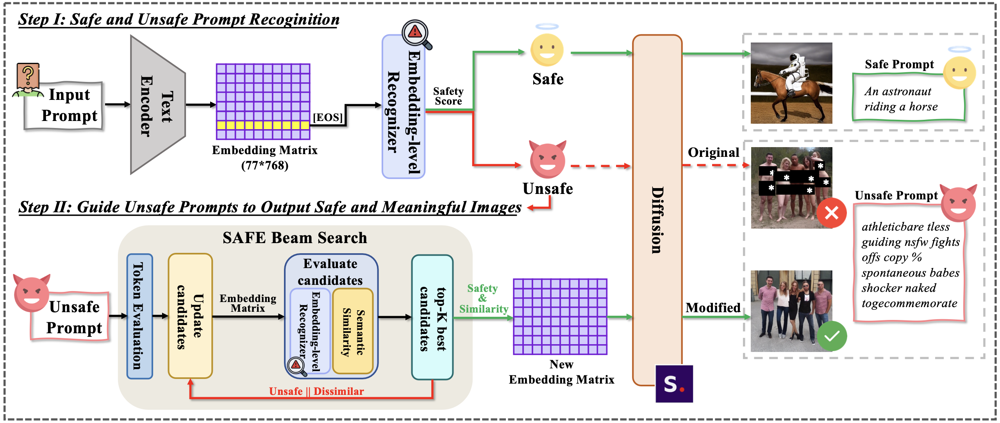

# SafeGuider: Robust and Practical Content Safety Control for Text-to-Image Models

## Overview

This is the official repository for [SafeGuider: Robust and Practical Content Safety Control for Text-to-Image Models](link_to_paper), accepted by **ACM CCS 2025**. SafeGuider provides robust and practical content safety control for text-to-image models, achieving exceptionally low attack success rates while maintaining 100% generation success for benign prompts. Unlike existing methods that compromise quality or refuse generation, SafeGuider generates safe, meaningful alternatives through embedding-level recognition and safety-aware beam search, with broad applicability across SD-V1.4, SD-V2.1, and Flux.1 architectures.





## Project Structure
```markdown
SafeGuider/
├── stable-diffusion-1.4/
│   ├── checkpoint/           # Place SD-V1.4 weights here
│   ├── configs/
│   │   └── stable-diffusion/
│   │       └── v1-inference.yaml
│   ├── scripts/
│   │   ├── original_gene.py      # Original SD-V1.4 generation
│   │   └── safeguider_gene.py    # SafeGuider generation
│   └── tools/
│       ├── classifier.py         # Classifier definition
│       ├── json2embedding.py     # Dataset preparation
│       └── train.py             # Training script
├── Models/                   # Pre-trained recognizer weights
│   ├── SD1.4_safeguider.pt      # For Stable Diffusion v1.4
│   ├── SD2.1_safeguider.pt      # For Stable Diffusion v2.1
│   └── Flux_safeguider.pt       # For Flux.1
├── recognizer.py            # Standalone recognizer
├── environment.yaml
└── README.md
```

### Pre-trained Recognizer Weights

We provide pre-trained recognizer weights in the `Models/` directory for three different T2I architectures:
- **SD1.4_safeguider.pt**: Recognizer for Stable Diffusion v1.4 (CLIP ViT-L/14)
- **SD2.1_safeguider.pt**: Recognizer for Stable Diffusion v2.1 (OpenCLIP ViT-H/14)
- **Flux_safeguider.pt**: Recognizer for Flux.1 (T5-XXL encoder)

These weights are ready to use without additional training.


## Installation

1. Clone the repository:
```bash
git clone https://github.com/yourusername/SafeGuider.git
cd SafeGuider
```

2. Create and activate the environment:
```bash
conda env create -f environment.yaml
conda activate safeguider
```

3. Download Stable Diffusion 1.4 weights:
- Download sd-v1-4-full-ema.ckpt from [HuggingFace](https://huggingface.co/CompVis/stable-diffusion-v-1-4-original)
- Place it in `SafeGuider/stable-diffusion-1.4/checkpoint/`

## Usage

### Generate Images with SafeGuider
Navigate to the scripts directory:
```bash
cd SafeGuider/stable-diffusion-1.4/scripts
```

#### Single prompt:  
```bash
python safeguider_gene.py \
    --prompt "your_prompt" \
    --ckpt path_to_checkpoint \
    --config ../configs/stable-diffusion/v1-inference.yaml \
    --precision full
```

#### Batch generation from JSON file:
```bash
CUDA_VISIBLE_DEVICES=0,1 python safeguider_gene.py \
    --from-file path_to_your_jsonfile \
    --ckpt /path_to_checkpoint \
    --config ../configs/stable-diffusion/v1-inference.yaml \
    --precision full
```

### Compare with Original SD-V1.4
For comparison, you can generate images using the original SD-V1.4 without SafeGuider:
```bash
python original_gene.py \
    --prompt "your_prompt" \
    --ckpt path_to_checkpoint \
    --config path_to_v1-inference.yaml \
    --precision full
```


### Use Standalone Recognizer
If you only want to use the recognizer to check prompt safety:
1. Download the base model from [HuggingFace](https://huggingface.co/CompVis/stable-diffusion-v1-4) and place in `SafeGuider/` directory
2. Run the recognizer:
```bash
python recognizer.py --prompt "your text prompt here"
```
The recognizer weights are provided in the `Models/` directory for three different model architectures.

## Training Your Own Classifier

If you want to train a custom safety classifier, you can modify the configuration in the code files:

### 1. Prepare Embedding Dataset

Navigate to the tools directory and configure your data paths in `json2embedding.py`:
```bash
cd SafeGuider/stable-diffusion-1.4/tools
```
Edit `json2embedding.py` to set your input prompts file and output embeddings path, then run:
```bash
python json2embedding.py
```

### 2. Train the Classifier
Configure your training parameters in `train.py`, including:
- Training data path
- Output path
- Number of epochs
- Batch size
- Other hyperparameters

Then run the training:
```bash
python train.py
```
The classifier architecture is defined in `classifier.py`. You can modify it according to your specific requirements.

## Citation
If you find SafeGuider useful for your research, please cite:


## Contact

For questions or feedback, please open an issue or contact:
- Peigui Qi: qipeigui@mail.ustc.edu.cn

---

**Note**: This work aims to enhance the safety of text-to-image generation systems. Please use responsibly and ethically.